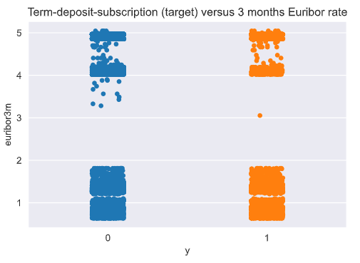
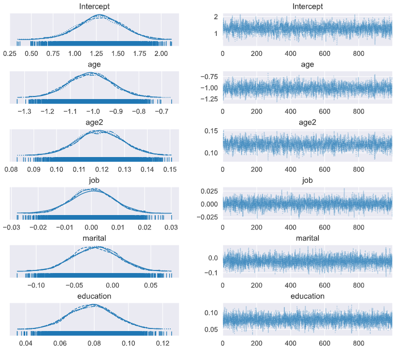
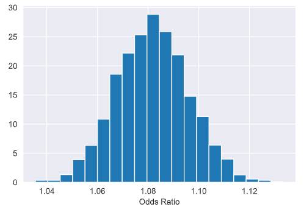

# Marketing campaign and customer subscription 
Bayesian Logistic Regression with Python and PyMC3 to predict customer subscription for a financial institution.

# Colab link*:
    * as the notebook size is over 25MB, it cant be hosted on github
    
https://drive.google.com/file/d/1qObgtd-ys-7fXJmkmla9jSqz-3qvpa6A/view?usp=sharing

# Summary:
Predict whether or not a customer will subscribe a term deposit after the marketing campaign the bank performed.

We want to be able to accomplish:
1. How likely a customer will subscribe to a term deposit?
2. Variables selection techniques
3. Exploratory Data Analysis
4. Model creation and selection process.

# Goal:
Create a binary classification model that predicts whether or not a customer will subscribe a term deposit after a marketing campaign the bank performed, based on many indicators. The target variable is given as y and takes on a value of 1 if the customer has subscribed and 0 otherwise.

# Tools:
1. Bayesian Logistic Regression
2. PyMC3
3. Theano
4. Sklearn

# Insights:

---
This code is free to use for academic purposes only, provided that a proper reference is cited. This code comes without technical support of any kind. Under no circumstances will the author be held responsible for any use of this code in any way.
